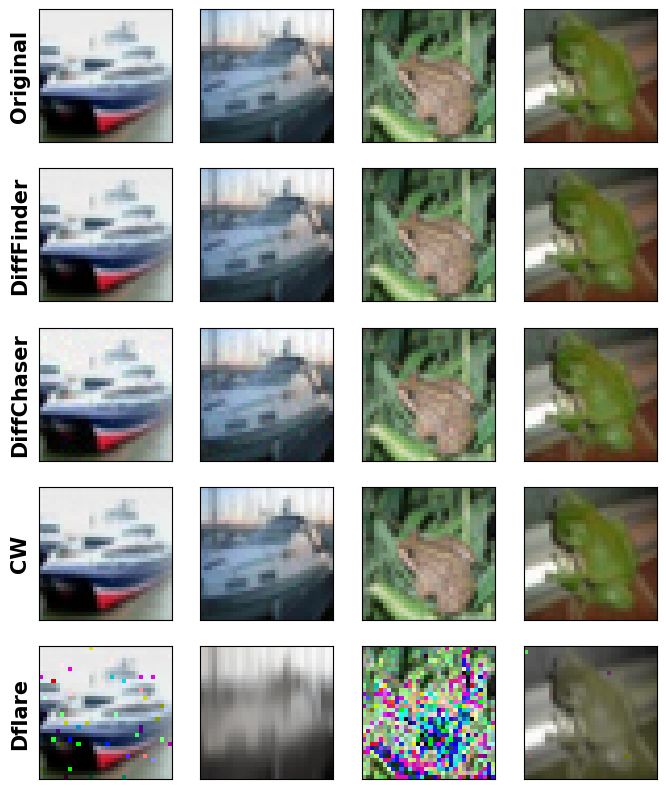
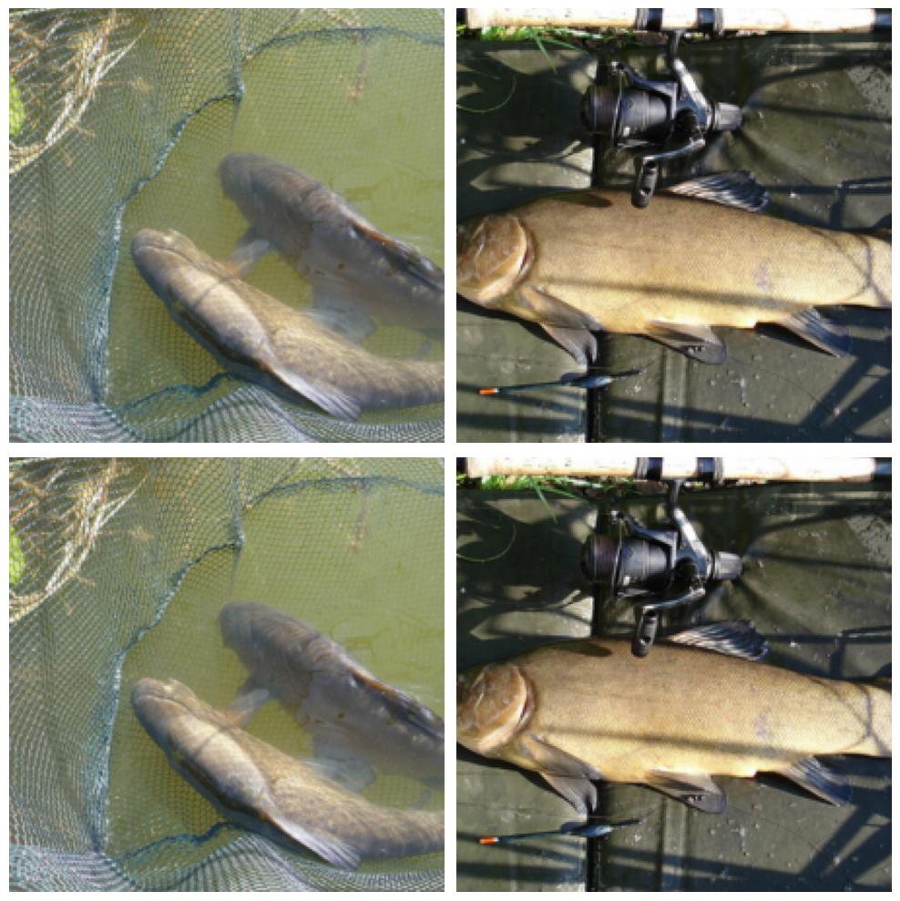

# Diff-Finder

## Usage

The toolkit directory contains our core code.

Display DiffFinder results

```
python show_result.py
```

We also provide an IPython notebook file to display generated images [here](./show_result.ipynb).

## Experiments

**Comparing Original and Generated Images**:

Our paper presents a table of experimental results, yet the produced images are relatively small and challenging to discern. Therefore, we exhibit high-definition versions of both the original image and those generated by various disagreement generation algorithms, facilitating easier observation of the differences by readers. 

Apparently, the DFLARE algorithm produces the lowest quality images. The DiffChaser algorithm exhibits blurriness in areas with averaged colors, accompanied by colored noise. Meanwhile, the results of the DiffFinder and CW algorithms are almost indistinguishable to the human eye, even in high-definition images.




## Additional Experiments
Besides the content of the research papers, we also compared the original images and generated images on ImageNet:



- Here is a display of the ImageNet image collection. In this display, the top row shows the original images, while the bottom row presents the images we generated. From these images, it's evident that it is almost impossible to distinguish between the original and our generated images with the naked eye, significantly demonstrating the high quality of the images we created.


